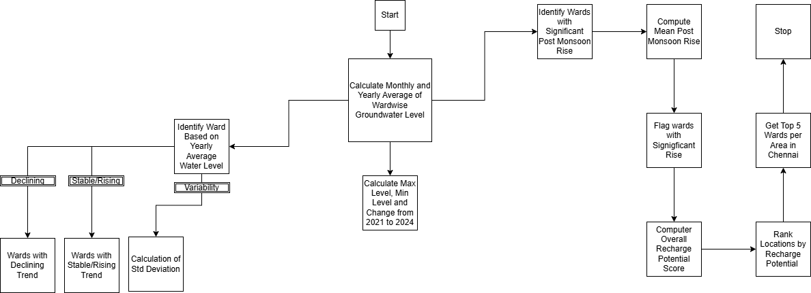
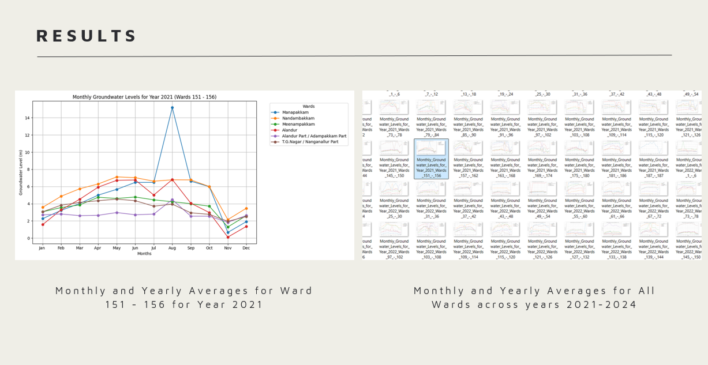
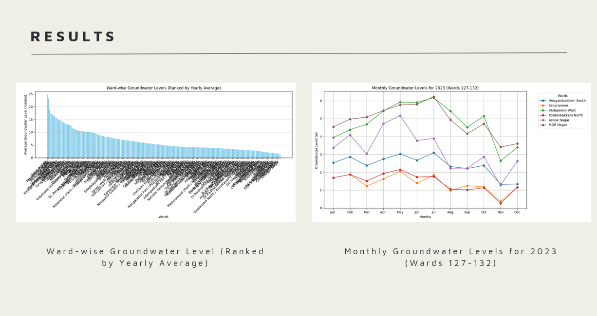
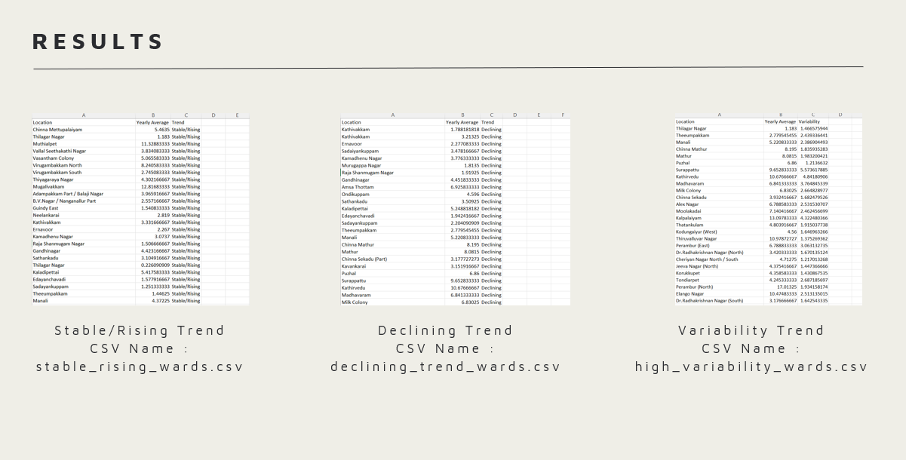
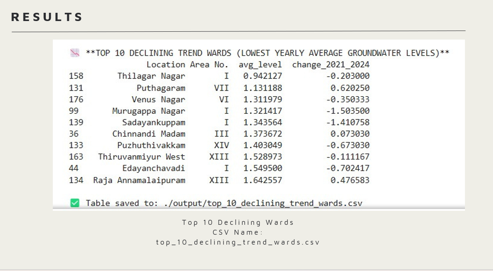
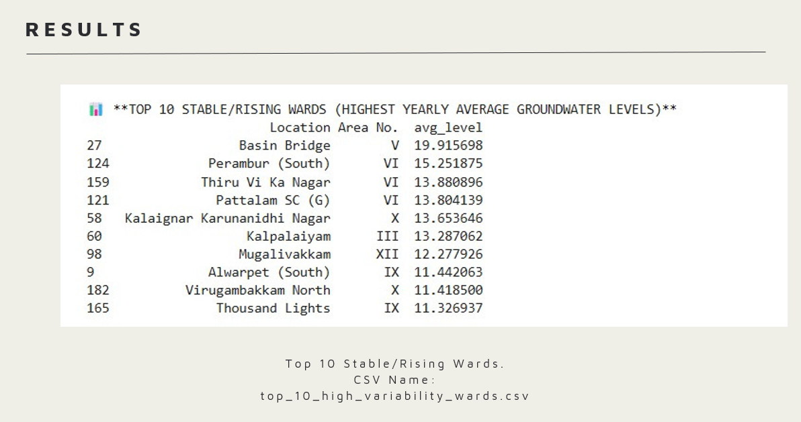
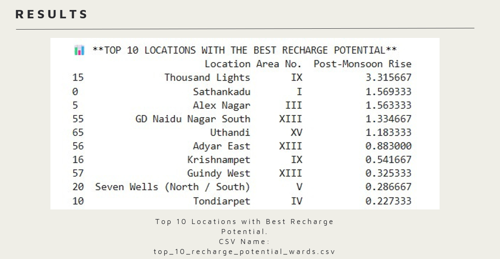
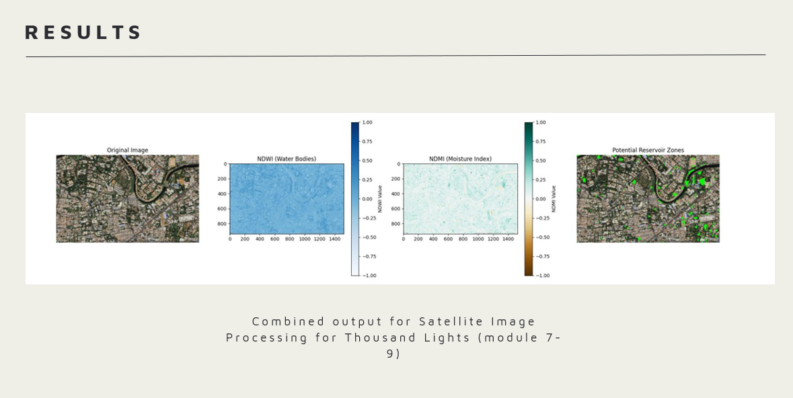
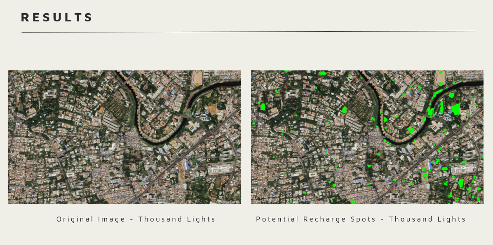

# Groundwater Analysis and Management

## Description

This project provides a comprehensive analysis of the impact of El Niño on groundwater levels in Chennai, India. The study focuses on identifying areas prone to water depletion and proposes sustainable water management solutions. Through the application of various datasets and predictive modeling techniques, this research contributes to understanding groundwater trends and recharge potential in the Chennai metropolitan area.

The analysis incorporates multi-year groundwater data to establish baseline conditions, assess temporal variations, and develop predictive models for future groundwater management strategies.

## Flowchart



<div align="center">

*Data Analysis Flowchart*


*Satellite Image Analysis Flowchart*

</div>

## Installation

### Prerequisites

- Python 3.7 or higher
- Jupyter Notebook or JupyterLab
- Git (for cloning the repository)

### Setup Instructions

1. Clone the repository:

   ```bash
   git clone https://github.com/srummanf/groundwater-analysis-management.git
   cd groundwater-analysis-management
   ```
2. Create a virtual environment:

   ```bash
   python -m venv env
   ```
3. Activate the virtual environment:

   ```bash
   # Windows
   env\Scripts\activate

   # macOS/Linux
   source env/bin/activate
   ```
4. Install required dependencies:

   ```bash
   pip install -r requirements.txt
   ```
5. Install Jupyter kernel for the virtual environment:

   ```bash
   python -m ipykernel install --user --name=groundwater-env --display-name "Python (Groundwater Analysis)"
   ```

## Usage

### Running the Analysis

1. Launch Jupyter Notebook:

   ```bash
   jupyter notebook
   ```
2. Navigate to the project directory and open the relevant notebook files.
3. Select the "Python (Groundwater Analysis)" kernel when prompted.
4. Execute the notebooks in the following recommended order:

   - `Module 2 - 4YRS - Temporal Analysis of Groundwater Levels.ipynb` - Multi-year temporal analysis of groundwater trends
   - `Module 3 - 4YRS - Ward-Level Comparative Analysis.ipynb` - Comparative analysis across Chennai wards
   - `Module 4 - Min Max and Extreme Year Changes in GW Level.ipynb` - Analysis of extreme variations in groundwater levels
   - `Module 5 - 4YRS - Identify Recharge Potential Areas.ipynb` - Identification and mapping of groundwater recharge potential areas
   - `Module 6 - Top 5 Recharge Potential.ipynb` - Detailed analysis of top recharge potential locations
   - `Module 7 8 9 - Finding Best Location to build reservoir.ipynb` - Strategic location analysis for reservoir construction

## Project Structure

```
groundwater-analysis-management/
├── Dataset/
│   ├── chennai-ground-water-levels-2021.csv
│   ├── chennai-ground-water-levels-2022.csv
│   ├── chennai-ground-water-levels-2023.csv
│   ├── chennai-ground-water-levels-2024.csv
├── Codebase/
│   ├── Module 2 - 4YRS - Temporal Analysis of Groundwater Levels.ipynb
│   ├── Module 3 - 4YRS - Ward-Level Comparative Analysis.ipynb
│   ├── Module 4 - Min Max and Extreme Year Changes in GW Level.ipynb
│   ├── Module 5 - 4YRS - Identify Recharge Potential Areas.ipynb
│   ├── Module 6 - Top 5 Recharge Potential.ipynb
│   └── Module 7 8 9 - Finding Best Location to build reservoir.ipynb
├── image/
├── requirements.txt
├── Documentation.md
├── LICENSE
└── README.md
```

## Datasets

The project utilizes the following datasets:

### Primary Datasets

**Source**: [Chennai Ward-wise Groundwater Levels - OpenCity Data Portal](https://data.opencity.in/dataset/chennai-ward-wise-groundwater-levels)

### Data Sources

All datasets are sourced from official government repositories through the OpenCity Data Portal (https://data.opencity.in/dataset/chennai-ward-wise-groundwater-levels), ensuring data authenticity and reliability for research purposes.

## Methodology

The analysis employs a multi-faceted approach:

1. **Data Preprocessing**: Cleaning, validation, and standardization of groundwater measurements
2. **Temporal Analysis**: Examination of seasonal and annual trends in groundwater levels
3. **Spatial Analysis**: Geographic mapping of water depletion patterns
4. **Statistical Modeling**: Development of predictive models using machine learning techniques
5. **Impact Assessment**: Correlation analysis between El Niño events and groundwater variations
6. **Management Strategy Development**: Evidence-based recommendations for sustainable water management

## Final Results



















## Contributing

We welcome contributions from researchers, data scientists, and water management professionals. Please follow these guidelines:

### How to Contribute

1. Fork the repository
2. Create a feature branch (`git checkout -b feature/new-analysis`)
3. Make your changes and add tests if applicable
4. Ensure all tests pass (`python -m pytest tests/`)
5. Commit your changes (`git commit -am 'Add new groundwater analysis feature'`)
6. Push to the branch (`git push origin feature/new-analysis`)
7. Create a Pull Request

### Reporting Issues

Please use the GitHub issue tracker to report bugs or suggest enhancements. Include:

- Clear description of the issue
- Steps to reproduce (for bugs)
- Expected vs. actual behavior
- System information (OS, Python version, etc.)

## License

This project is licensed under the BSD 3-Clause License. See the [LICENSE](LICENSE) file for full details.

### License Summary

The BSD 3-Clause License allows for:

- Commercial use
- Distribution
- Modification
- Private use

With the following conditions:

- License and copyright notice must be included
- No liability or warranty provided

## Citation

If you use this project in your research, please cite:

```bibtex
@software{groundwater_analysis_2024,
  title={Groundwater Analysis and Management: El Niño Impact Assessment in Chennai},
  author={[Author Names]},
  year={2024},
  url={https://github.com/srummanf/groundwater-analysis-management},
  version={1.0.0}
}
```
